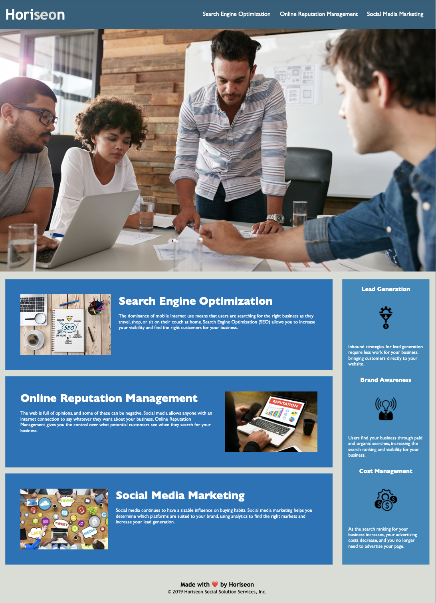

# Horiseon Code Refactor

The purpose of this project is to refactor the website of Horiseon, a marketing agency, for increasing its web accessibility. By doing so, the site will gain higher ranking in search engines and generate more traffic for the business. Accessible sites benefit the public regardless of disability, and hence adhere to accessibility standards.

All elements from the site have been improved for long-term sustainability without the change of site appearance and functionality. 

The following image shows the web application's appearance:

## Built With

* [HTML](https://developer.mozilla.org/en-US/docs/Web/HTML)
* [CSS](https://developer.mozilla.org/en-US/docs/Web/CSS)
* [w3schools](https://www.w3schools.com/html/html5_semantic_elements.asp)

## Deployed Link

* [Horiseon](https://mandytsang007.github.io/RefactoringForHoriseon/)
* [Link to Github](https://github.com/MANDYTSANG007)

## Authors

* **Mandy Tsang** 

## License

This project is licensed under the MIT License 

